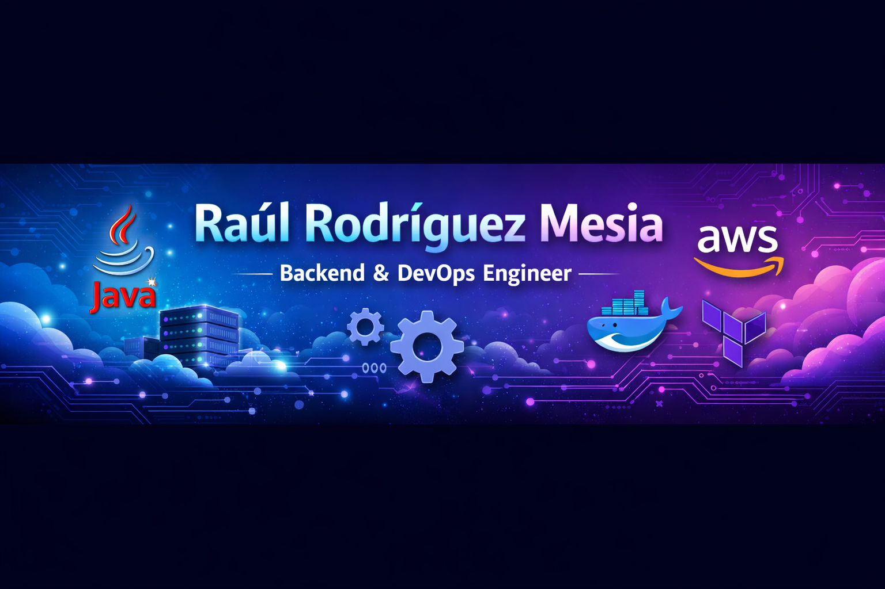
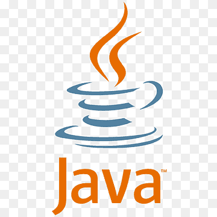
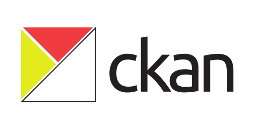
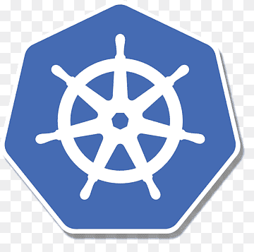

  

## 🎯 Certificaciones en progreso

  
  
  
  
  

---

## ⚡ Skills & Tools

**Java • Spring Boot • AWS • Terraform • Docker • GitHub Actions • Jenkins • Grafana • Prometheus • Linux**

---

## 📊 Impacto

- 🚀 Mejora de disponibilidad de sistemas en **+30%** con observabilidad avanzada.  
- ⚡ Reducción de latencia en **200ms** aplicando caching distribuido.  
- 🔒 Implementación de pipelines CI/CD con **Shift-Left Security**.  

---

## 🔥 Lo que estoy construyendo ahora

- Portafolio PWA con i18n + Service Worker  
- Optimización de costos en AWS con MLflow  
- Arquitectura hexagonal en proyectos Spring Boot  

---

## 📈 Roadmap público

- [ ] Completar 5 certificaciones  
- [ ] Migrar proyectos a arquitectura hexagonal  
- [ ] Optimizar Lighthouse (Perf >90, Acc >95, SEO >95)  

---

## 📂 Proyectos destacados

* 📂 **[Automatización de Convocatorias](https://github.com/raulrodriguezmesia-blip/automatizacion-convocatorias):** Sistema empresarial Fullstack desarrollado con Java 17, Spring Boot y React. Cuenta con arquitectura desacoplada, despliegue automatizado con Docker Compose y observabilidad nativa usando Spring Actuator, Prometheus y Grafana.

* 📂 **[Resilient Feature Flag Manager](https://github.com/raulrodriguezmesia-blip/springboot-feature-flag):** Implementación avanzada de gestión de banderas de funcionalidad optimizada con caché distribuida en Redis para asegurar alta disponibilidad y baja latencia en entornos productivos.

---

¡Haz los cambios que consideres necesarios en tu perfil y repositorios! Avísame cuando los tengas listos pasándome el enlace o los textos modificados, y procederé a hacerte la **auditoría técnica final y el informe de preparación para el mercado español**. 

---

*Última actualización: julio 2026*
