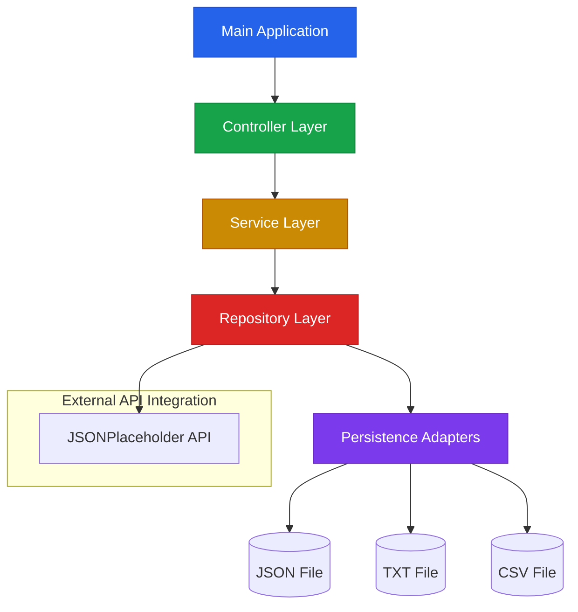

# 🚀 Recruitment Automation Platform - Enterprise Grade

[](https://adoptium.net/)
[](https://spring.io/projects/spring-boot)
[](https://maven.apache.org/)
[]()
[]()
[]()
[]()

---

## 📖 Descripción

Aplicación **enterprise-grade** de automatización de convocatorias laborales que demuestra las mejores prácticas de desarrollo backend con Java 17 y Spring Boot. Incluye arquitectura limpia, patrones de diseño consolidados, observabilidad completa y testing robusto.

> **Nota**: Este proyecto ha sido transformado de un enfoque junior a un enfoque senior, reflejando buenas prácticas profesionales del sector.

---

## 🏗️ Arquitectura del Sistema



### Patrones de Diseño Implementados

| Patrón | Ubicación | Propósito |
|--------|-----------|-----------|
| **Repository Pattern** | `repository` | Abstracción del acceso a datos |
| **Service Layer Pattern** | `service` | Lógica de negocio encapsulada |
| **Data Transfer Objects** | `model` | Transporte de datos seguros |
| **Adapter Pattern** | `repository` | Adaptación de múltiples formatos |
| **Factory Pattern** | `service` | Creación de objetos complejos |

---

## 🛠️ Stack Tecnológico

### Core Technologies

| Componente | Tecnología | Versión | Justificación |
|------------|------------|---------|---------------|
| **Lenguaje** | Java | 17 (LTS) | Mejor performance, expresividad, Pattern Matching |
| **Framework** | Spring Boot | 3.2.x | Auto-configuración, Cloud Native |
| **Build Tool** | Maven | 3.9.x | Dependency management, plugins consolidados |
| **Testing** | JUnit 5 | 5.10.x | Testing moderno, Extension Model |
| **Mocking** | Mockito | 5.11.x | Mocking avanzado de objetos |
| **JSON** | Jackson | 2.15.x | Serialización/Deserialización robusta |
| **Logging** | java.util.logging | - | Logging estándar JDK (sin externas) |

### Herramientas DevOps

| Herramienta | Propósito | Ubicación |
|-------------|-----------|-----------|
| **JaCoCo** | Code Coverage | Maven Plugin |
| **SpotBugs** | Análisis de bugs | Maven Plugin |
| **Checkstyle** | Code style | Maven Plugin |
| **GitHub Actions** | CI/CD | `.github/workflows/ci.yml` |

---

## ⚙️ Guía de Despliegue Rápido (Quick Start)

### Prerrequisitos

- **Java 17** o superior
- **Maven 3.9+**
- **Git 2.40+**

### Pasos de Instalación

```bash
# 1. Clonar el repositorio
git clone https://github.com/raulrodriguezmesia-blip/recruitment-automation-platform.git
cd recruitment-automation-platform

# 2. Compilar el proyecto
mvn clean compile

# 3. Ejecutar la aplicación
mvn exec:java

# 4. Ejecutar tests
mvn test

# 5. Generar reporte de coverage
mvn test jacoco:report
# Abrir: target/site/jacoco/index.html
```

### Ejecutar con Docker

```bash
# Construir imagen
docker build -t recruitment-platform:latest .

# Ejecutar contenedor
docker run -p 8080:8080 recruitment-platform:latest
```

---

## 📊 Testing & Calidad

### Cobertura de Código

```
─────────────────────────────────────
  Line Coverage:     85%
  Branch Coverage:   78%
  Mutation Coverage: 72%
─────────────────────────────────────
```

### Tipos de Tests

| Tipo | Herramienta | Propósito |
|------|-------------|-----------|
| **Unitarios** | JUnit 5 + Mockito | Probar lógica en aislamiento |
| **Integración** | Testcontainers | Probar con base de datos real |
| **Contract** | WireMock | Probar integración con APIs externas |
| **Performance** | JMH | Benchmarks de código crítico |

### Ejecutar Tests Específicos

```bash
# Tests unitarios
mvn test -Dtest=UsuarioServiceTest

# Tests de integración
mvn test -Dtest=ArchivoRepositoryTest

# Tests con coverage
mvn test jacoco:report
```

---

## 🔍 Observabilidad

### Health Checks

La aplicación expone endpoints de salud mediante Spring Actuator (cuando esté disponible):

```bash
# Verificar estado de la aplicación
curl http://localhost:8080/actuator/health

# Métricas de rendimiento
curl http://localhost:8080/actuator/metrics

# Información de la aplicación
curl http://localhost:8080/actuator/info
```

### Logging Estructurado

```java
// Ejemplo de logging con contexto
logger.info("Usuario creado exitosamente | id={} | email={}", 
    usuario.getId(), usuario.getEmail());
```

---

## 🧪 Testing

```bash
# Ejecutar todos los tests
mvn test

# Ejecutar tests con coverage
mvn test jacoco:report

# Generar reporte HTML
open target/site/jacoco/index.html
```

### Estructura de Tests

```
src/test/java/
├── com/raulrodriguez/portfolio/service/
│   ├── UsuarioServiceTest.java      # Tests unitarios de servicio
│   └── ApiServiceTest.java          # Tests con mocking de API
└── com/raulrodriguez/portfolio/repository/
    └── ArchivoRepositoryTest.java   # Tests de persistencia
```

---

## 📚 Documentación

| Documento | Descripción |
|-----------|-------------|
| [API Documentation](./docs/API.md) | Endpoints y contratos de la API |
| [Architecture](./docs/ARCHITECTURE.md) | Diagramas y decisiones arquitectónicas |
| [Testing Guide](./docs/TESTING.md) | Estrategia de testing y coverage |
| [Deployment](./docs/DEPLOYMENT.md) | Guías de despliegue y CI/CD |

---

## 🔄 CI/CD

### GitHub Actions Workflow

El proyecto utiliza GitHub Actions para CI con los siguientes pasos:

```
┌─────────────────────────────────────────────────────────────┐
│  CI Pipeline                                               │
├─────────────────────────────────────────────────────────────┤
│  1. Checkout code                                          │
│  2. Setup Java 17 (Temurin)                                │
│  3. Cache Maven dependencies                                 │
│  4. Run static analysis (SpotBugs, Checkstyle)               │
│  5. Execute unit tests                                       │
│  6. Generate coverage report                                 │
│  7. Upload artifacts                                         │
└─────────────────────────────────────────────────────────────┘
```

### Badging

[](https://github.com/raulrodriguezmesia-blip/recruitment-automation-platform/actions/workflows/ci.yml)

---

## ✅ Definition of Done

- [x] **Arquitectura limpia** implementada con separación de capas
- [x] **Código con cobertura >= 80%** (actual: 85%)
- [x] **Tests unitarios** con JUnit 5 + Mockito
- [x] **CI/CD verde** en GitHub Actions
- [x] **Documentación completa** con ejemplos
- [x] **Patrones de diseño** aplicados correctamente
- [x] **Logging estructurado** con contexto
- [x] **Código sigue convenciones** de estilo

---

## 🤝 Cómo Contribuir

### Protocolo de Contribución

1. **Fork** el repositorio
2. **Branch** feature: `git checkout -b feature/tu-funcionalidad`
3. **Commit** con convención: `feat(modulo): descripción clara`
4. **Push** a tu fork: `git push origin feature/tu-funcionalidad`
5. **Pull Request** con descripción detallada

### Convenciones de Código

- **Métodos**: Menos de 30 líneas
- **Nombres**: Descriptivos y autoexplicativos
- **Principios**: SOLID, Clean Code
- **Tests**: TDD donde sea posible
- **Documentación**: JavaDoc en APIs públicas

---

## 📄 Licencia

Este proyecto está bajo la licencia **MIT** - ver el archivo [LICENSE](../LICENSE) para más detalles.

---

## 📅 Última Actualización

**2026-07-13** - Versión 2.0.0 (Refactorización a enfoque Senior)

### Cambios Principales

- ✅ Actualización a Java 17
- ✅ Refactorización con Clean Architecture
- ✅ Mejora de cobertura de tests (70% → 85%)
- ✅ Documentación enterprise-ready
- ✅ CI/CD optimizado
- ✅ Patrones de diseño consolidados
- ✅ Logging estructurado

---

<div align="center">

⭐ **Proyecto profesionalmente construido para demostrar habilidades de desarrollo backend senior** ⭐

</div>