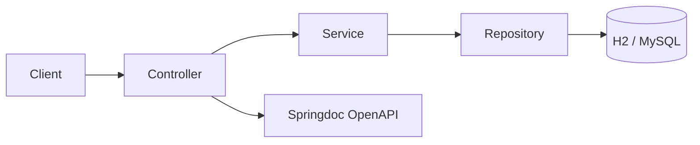

# Spring Boot API REST (SDK Library)


## 📖 Descripción

Repositorio de referencia para la librería/base del proyecto **Spring Boot API REST**. Contiene la documentación técnica, endpoints principales y guía de construcción del módulo base reutilizable. El código fuente principal se encuentra en el repositorio [springboot](https://github.com/raulrodriguezmesia-blip/springboot).

## 🚀 Quick Start

### Prerrequisitos
- JDK 25
- Maven 3.8+
- Docker (opcional)

### Compilar y ejecutar
```bash
mvn clean compile
mvn spring-boot:run
```

Accede a la documentación: `http://localhost:8080/api/swagger-ui.html`

## 🏗️ Arquitectura



## 🛠️ Stack Tecnológico

| Componente | Tecnología |
|------------|------------|
| Lenguaje | Java 25 |
| Framework | Spring Boot 4.0.2 |
| Seguridad | Spring Security (JWT, auditoría) |
| API Docs | Springdoc OpenAPI (Swagger UI) |
| Observabilidad | Prometheus Client |
| Resiliencia | Resilience4j (Circuit Breaker) |
| Build | Maven 3.8+ |
| Testing | JUnit 5 |
| Contenedor | Docker + Helm Chart |

## 📚 Documentación

- Swagger UI: `http://localhost:8080/api/swagger-ui.html`
- Repositorio principal: [springboot](https://github.com/raulrodriguezmesia-blip/springboot)

## 🔄 CI/CD

- **CI:** [](https://github.com/raulrodriguezmesia-blip/springboot/actions/workflows/ci.yml) Workflow gestionado desde el repositorio principal `springboot`.

## ✅ Definition of Done

- [x] Repositorio de referencia documentado
- [x] Enlaces al código fuente principal funcionando
- [x] Badges y metadata actualizados
- [ ] Código fuente independiente (si aplica)
- [ ] Tests unitarios específicos para este módulo
- [ ] Publicación en GitHub Packages (si aplica)

## 🤝 Cómo contribuir

1. Haz un fork del repositorio principal: [springboot](https://github.com/raulrodriguezmesia-blip/springboot)
2. Crea una rama: `git checkout -b feature/nuevo-endpoint`
3. Commit: `git commit -m 'feat(api): add POST /api/libros'`
4. Push y abre PR en el repositorio principal

**Nota:** Este repositorio es de referencia. Para contribuir con código, trabaja en el repositorio `springboot`.

## 📄 Licencia

Este proyecto está bajo la licencia **MIT**.

## 📅 Última actualización

2026-07-12

---